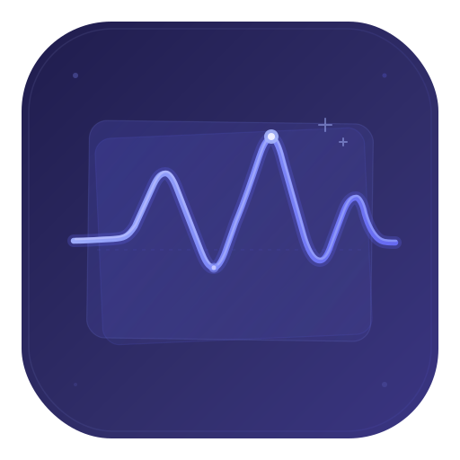

# <div align="center"></div>

# <div align="center">VibeDeck</div>

<div align="center">

[](https://github.com/ivasuy/VibeDeck/releases/latest)
[](https://www.npmjs.com/package/vibedeck-cli)
[](https://github.com/ivasuy/homebrew-tap)
[](LICENSE)

</div>

<div align="center">

Local-first analytics, audit trails, and live operational visibility for AI coding workflows.

</div>

<div align="center">

VibeDeck tracks AI coding usage across providers, projects, worktrees, branches, sessions, checkpoints, skills, and native app surfaces. It gives individual AI power users and engineering teams one place to see what is running now, what it already cost, which models were used, and how work moved across repositories over time.

</div>

<p align="center">
  
</p>

## Install

### macOS app

- [Download `VibeDeck.dmg`](https://github.com/ivasuy/VibeDeck/releases/latest/download/VibeDeck.dmg)
- [Download the universal app zip](https://github.com/ivasuy/VibeDeck/releases/latest/download/VibeDeck-0.1.1-universal.zip)
- [View the latest release](https://github.com/ivasuy/VibeDeck/releases/latest)

### Homebrew

```bash
brew install ivasuy/tap/vibedeck
```

### npm

```bash
npm install -g vibedeck-cli
```

Run without installing globally:

```bash
npx vibedeck-cli serve
```

## Product Showcase

<table>
  <tr>
    <td width="34%" align="center"><strong>macOS app</strong></td>
    <td width="33%" align="center"><strong>Dashboard</strong></td>
    <td width="33%" align="center"><strong>Widgets</strong></td>
  </tr>
  <tr>
    <td align="center">
      <video src="https://github.com/user-attachments/assets/5e2cb6e6-8226-47c8-9a9e-a59187de6b8e" width="100%" autoplay muted loop playsinline controls></video>
    </td>
    <td align="center">
      <video src="https://github.com/user-attachments/assets/f1ee0746-e3fa-4bfb-b948-5736c1683fb5" width="100%" autoplay muted loop playsinline controls></video>
    </td>
    <td align="center">
      <video src="https://github.com/user-attachments/assets/80437953-271d-4440-b479-8bf31ace7f97" width="100%" autoplay muted loop playsinline controls></video>
    </td>
  </tr>
  <tr>
    <td align="center">Native macOS shell around the local VibeDeck backend, with release packaging and desktop-first onboarding.</td>
    <td align="center">Full dashboard for live sessions, branches, usage rollups, Entire checkpoints, diagnostics, and project audit.</td>
    <td align="center">Compact desktop surfaces for glanceable live cost, token, and session activity throughout the day.</td>
  </tr>
</table>

## Why VibeDeck

Most AI coding activity is fragmented across terminals, runtime hooks, transient sessions, local SQLite files, JSONL streams, provider-specific directories, and checkpoints that disappear from view once a session ends.

VibeDeck turns that into one local system of record.

It does not stop at account-level billing. It maps activity to:

- provider
- model
- project
- repo
- worktree
- branch
- session
- checkpoint
- skill and tool context

That makes it useful both as a personal command center and as an engineering audit layer.

## Built For Power Users And Teams

### For individual AI power users

- Watch live workstreams across Codex, Claude Code, Cursor, Gemini CLI, OpenCode, OpenClaw, and mixed-provider sessions.
- See current token burn and total accumulated spend instead of waiting for provider dashboards to catch up.
- Track usage by project, branch, worktree, session, and Entire checkpoint.
- Keep historical audit history even after a session goes stale or a branch becomes inactive.
- Use the local dashboard, widgets, CLI, and native app as one operating surface.

### For teams and engineering managers

- Understand AI coding usage without forcing engineers into a hosted telemetry product.
- Compare branch-level, project-level, and provider-level concentration from one local-first product.
- Preserve local audit records for sessions, tokens, models, and cost over time.
- Review active workstreams, historical project rollups, and checkpoint traces with shared language across desktop and web surfaces.
- Keep prompts and responses on local machines while still gaining operational visibility.

## Supported Providers

| | Provider | Supported | Input |
|---|----------|-----------|-------|
|  | Codex CLI | Yes | JSONL rollout logs and session usage |
|  | Claude Code | Yes | JSONL transcripts and hook-aware local state |
|  | Cursor | Yes | Local SQLite runtime data |
|  | Gemini CLI | Yes | Local JSON session files |
|  | OpenCode | Yes | Local SQLite channel and message tables |
|  | OpenClaw | Yes | JSONL agent logs |
|  | Kiro / Kiro CLI | Yes | Local chat files and runtime traces |
|  | Kimi Code | Yes | Local provider session data |
|  | GitHub Copilot CLI | Yes | Legacy CLI state and VS Code transcripts |
|  | Hermes Agent | Yes | Local agent runtime files |
|  | Antigravity | Yes | Local provider runtime state |
Some providers are hook-based. Others are passive readers over local JSONL, SQLite, CSV, or native app state. VibeDeck is designed for mixed-runtime environments rather than single-provider lock-in.

## What VibeDeck Tracks

- Live sessions and active workstreams
- Project, repo, worktree, branch, and session rollups
- Token usage and model-aware cost
- Provider, model, and branch concentration
- Entire checkpoints and checkpoint usage metadata
- Skill and integration management signals
- Historical audit data preserved in SQLite
- Local integration health, sync status, and doctor diagnostics

## Feature Highlights

### Live operational view

VibeDeck shows what is running now, not just what ran earlier. Live pages combine real-time session activity with preserved historical cost and token totals, so active projects do not lose their prior context when a session goes stale and comes back later.

### Branch and worktree attribution

Usage is rolled up under the actual engineering structure people work in: project, repo, worktree, branch, and session. That makes branch-level cost, model, and token history inspectable rather than disappearing into provider-wide spend totals.

### Entire checkpoint visibility

VibeDeck reads Entire checkpoint metadata, groups checkpoint files, surfaces model usage, and preserves checkpoint context as part of project audit. That gives you a clearer view of handoffs, manual commits, multi-session checkpoints, and historical model usage around saved work.

### Skill and integration management

VibeDeck is not only a dashboard for cost. It also keeps track of local integrations, skill-related runtime state, provider hooks, README sync, native install bootstrap, and local health surfaces through `status`, `doctor`, and setup flows. That makes it useful as both an analytics product and an operational layer for AI-heavy developer setups.

### Native macOS app and widgets

The product includes a packaged macOS app and desktop widgets, so VibeDeck can live outside the browser and act more like a daily operating surface than a hidden developer tool.

### Canonical local audit ledger

Default local state lives under `~/.vibedeck/`, with canonical usage stored in SQLite and compatibility queue exports preserved alongside it. This keeps VibeDeck local-first while still giving you stable historical rollups and reconciliation surfaces.

## Quick Start

Initialize local integrations:

```bash
vibedeck init
```

Sync local usage into the canonical database:

```bash
vibedeck sync
```

Start the local dashboard:

```bash
vibedeck serve
```

Then open:

```text
http://127.0.0.1:7690
```

## Common Commands

```bash
vibedeck serve
vibedeck sync
vibedeck status
vibedeck doctor
vibedeck auth show
vibedeck auth rotate
vibedeck readme-sync status
```

More examples live in [docs/COMMANDS.md](docs/COMMANDS.md).

## Local-First Architecture

Default local state:

```text
~/.vibedeck/
  auth.token
  cache/pricing.json
  tracker/
    vibedeck.sqlite3
    cursors.json
    queue.jsonl
    project.queue.jsonl
    diagnostics/
```

`vibedeck.sqlite3` is the canonical local store for sessions, branches, projects, checkpoints, usage buckets, and historical audit state.

## FAQ

### Does VibeDeck upload prompts and responses?

No. VibeDeck is local-first. It reads local usage signals, computes rollups locally, and stores state under `~/.vibedeck/`.

### Is VibeDeck only for one provider?

No. VibeDeck is designed for mixed-runtime AI coding workflows and can ingest usage from multiple local providers into one product.

### Is it only a dashboard?

No. VibeDeck includes a dashboard, CLI, packaged macOS app, widgets, Entire checkpoint support, local integrations, and health/debug tooling.

### What makes it different from provider billing dashboards?

Provider billing pages usually stop at account-level usage. VibeDeck maps cost and token usage to branch, worktree, project, session, and checkpoint context, which is much closer to how engineering work is actually organized.

## Resources

- [Commands](docs/COMMANDS.md)
- [Architecture](docs/ARCHITECTURE.md)
- [OpenClaw integration](docs/OPENCLAW.md)

## License

MIT
