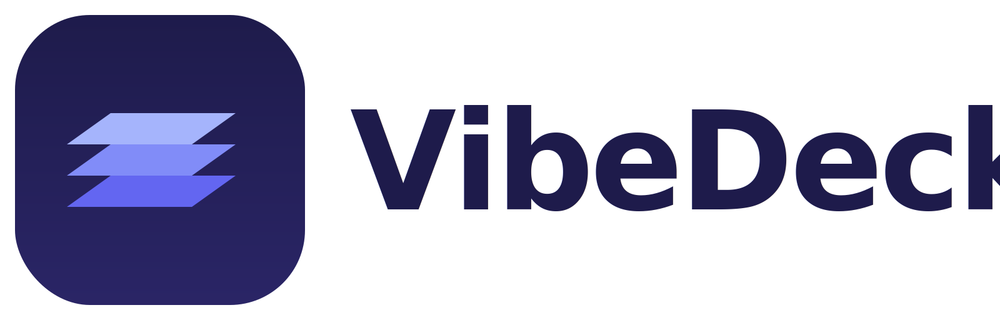
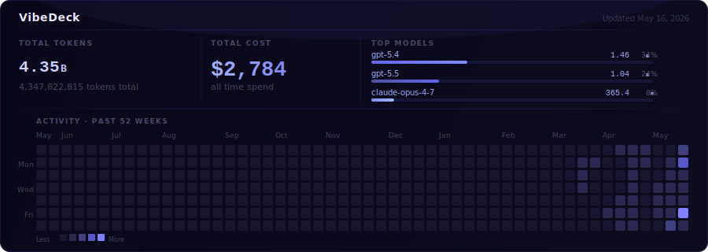
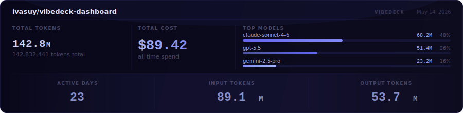

<div align="center">
  <picture>
    <source media="(prefers-color-scheme: dark)" srcset="./dashboard/public/wordmark-dark.svg">
    <source media="(prefers-color-scheme: light)" srcset="./dashboard/public/wordmark.svg">
    
  </picture>
</div>

<div align="center">

[![macOS release][macos-badge]][release]
[![npm version][npm-badge]][npm]
[![Homebrew tap][brew-badge]][tap]
[![license][license-badge]][license]

</div>

<div align="center">

VibeDeck shows you what every AI coding tool on your machine is burning, in real time, all in one place.

</div>

<div align="center">

Local-first. Multi-provider. Mac-native as the premier surface, with CLI and dashboard access for everyone. Branch-aware when you want to go deeper.

</div>

## Why VibeDeck

AI coding spend is scattered across local logs, provider folders, app state, and session files. VibeDeck turns that into one local view of what is active now, what it has burned, and where that usage belongs.

The product is built around three promises:

- See live spend across the AI coding tools you actually use.
- Keep the data local on your machine instead of sending prompts or transcripts to a hosted analytics service.
- Drill into projects and branches when attribution is available, without hiding existing non-git local work.

VibeDeck is not a hosted team telemetry product. If you want to share a snapshot, use exports, screenshots, or README banners.

## Built For Local AI Power Users

VibeDeck is for developers who run AI coding tools locally and want one surface for current sessions, local usage history, provider status, and project context. The Mac app is the premier surface, with the CLI and browser dashboard still available when you want terminal workflows or a local web view.

For team sharing, VibeDeck stays intentionally local-first. Share exports, screenshots, or README banners instead of uploading developer telemetry to a hosted service.

## Install

### macOS app

- [Download `VibeDeck.dmg`](https://github.com/ivasuy/VibeDeck/releases/latest/download/VibeDeck.dmg)
- [Download the universal app zip](https://github.com/ivasuy/VibeDeck/releases/latest/download/VibeDeck-0.1.3-universal.zip)
- [View the latest release](https://github.com/ivasuy/VibeDeck/releases/latest)

### Homebrew

```bash
brew install ivasuy/tap/vibedeck
```

### npm

```bash
npm install -g vibedeck-cli
```

Run without installing globally:

```bash
npx vibedeck-cli serve
```

## Product Showcase

<table>
  <tr>
    <td width="34%" align="center"><strong>macOS app</strong></td>
    <td width="33%" align="center"><strong>Dashboard</strong></td>
    <td width="33%" align="center"><strong>Widgets</strong></td>
  </tr>
  <tr>
    <td align="center">
      <a href="https://github.com/user-attachments/assets/5e2cb6e6-8226-47c8-9a9e-a59187de6b8e">
        
      </a>
    </td>
    <td align="center">
      <a href="https://github.com/user-attachments/assets/f1ee0746-e3fa-4bfb-b948-5736c1683fb5">
        
      </a>
    </td>
    <td align="center">
      <a href="https://github.com/user-attachments/assets/80437953-271d-4440-b479-8bf31ace7f97">
        
      </a>
    </td>
  </tr>
  <tr>
    <td align="center">Native macOS shell around the local VibeDeck backend, with release packaging and desktop-first onboarding.</td>
    <td align="center">Local dashboard for live sessions, branch rollups, provider status, diagnostics, and project views.</td>
    <td align="center">Compact desktop surfaces for glanceable live usage, spend estimates, and session state throughout the day.</td>
  </tr>
</table>

## Supported Providers

| Icon | Provider | Supported | Input |
|:---:|----------|-----------|-------|
|  | Codex CLI | Yes | JSONL rollout logs and session usage |
|  | Claude Code | Yes | JSONL transcripts and hook-aware local state |
|  | Cursor | Yes | Local SQLite runtime data |
|  | Gemini CLI | Yes | Local JSON session files |
|  | OpenCode | Yes | Local SQLite channel and message tables |
|  | OpenClaw | Yes | JSONL agent logs |
|  | Kiro / Kiro CLI | Yes | Local chat files and runtime traces |
|  | Kimi Code | Yes | Local provider session data |
|  | GitHub Copilot CLI | Yes | Legacy CLI state and VS Code transcripts |
|  | Hermes Agent | Yes | Local agent runtime files |
|  | Antigravity | Yes | Local provider runtime state |

Some providers are hook-based. Others are passive readers over local JSONL, SQLite, CSV, or native app state. Attribution depth depends on the local records each provider exposes, so VibeDeck is designed for mixed-runtime environments rather than single-provider lock-in.

## What VibeDeck Tracks Today

- Live sessions and active workstreams
- Provider and model usage where local data is available
- Project and branch rollups for attributed local sessions
- Existing non-git local folders as visible projects
- Historical local usage preserved in SQLite
- Local integration health, sync status, and doctor diagnostics

## Feature Highlights

### Live local view

VibeDeck shows what is running now, not just what ran earlier. Live pages combine real-time session state with preserved historical local usage, so active projects do not lose their prior context when a session goes stale and comes back later.

### Branch and worktree attribution

When local records include enough context, usage can roll up under the engineering structure people work in: project, repo, worktree, branch, and session. Existing local folders without git metadata still remain visible instead of being discarded.

### Native macOS app and widgets

The packaged macOS app and desktop widgets let VibeDeck live outside the browser and act more like a daily operating surface than a hidden developer tool. The dashboard and CLI continue to cover local web and terminal workflows.

### Canonical local ledger

Default local state lives under `~/.vibedeck/`, with canonical usage stored in SQLite and compatibility queue exports preserved alongside it. This keeps VibeDeck local-first while still giving you stable historical rollups and reconciliation surfaces.

## Power User Surfaces

VibeDeck also includes supporting surfaces for developers who want deeper local context after the core live-spend view is working.

### Entire checkpoint visibility

VibeDeck reads Entire checkpoint metadata where available, groups checkpoint files, surfaces model usage, and preserves checkpoint context as part of project audit. This is supporting context for saved work, handoffs, and multi-session history rather than the headline product promise.

### Skill and integration management

VibeDeck keeps track of local integrations, skill-related runtime state, provider hooks, README sync, native install bootstrap, and local health surfaces through `status`, `doctor`, and setup flows. These are power-user operations for maintaining an AI-heavy local setup.

### README Banner Showcase

Dual-banner README surfaces provide optional profile-level visibility and project-level context.

#### GitHub Profile README Banner

<p align="center">
  
</p>

Profile-ready usage surface with cross-provider model mix, token scale, estimated cost rollups, and trend context.

#### Project README Banner

##### Project Usage

<!-- vibedeck:project-stats:start -->

<!-- vibedeck:project-stats:end -->

Repository-local usage surface focused on the active project path, with model split, token mix, estimated cost, and snapshot context.

## Quick Start

Initialize local integrations:

```bash
vibedeck init
```

Sync local usage into the canonical database:

```bash
vibedeck sync
```

Start the local dashboard:

```bash
vibedeck serve
```

Then open:

```text
http://127.0.0.1:7690
```

## Common Commands

```bash
vibedeck serve
vibedeck sync
vibedeck status
vibedeck doctor
vibedeck auth show
vibedeck auth rotate
vibedeck readme-sync status
```

More examples live in [docs/COMMANDS.md](docs/COMMANDS.md).

## Local-First Architecture

Default local state:

```text
~/.vibedeck/
  auth.token
  cache/pricing.json
  tracker/
    vibedeck.sqlite3
    cursors.json
    queue.jsonl
    project.queue.jsonl
    diagnostics/
```

`vibedeck.sqlite3` is the canonical local store for sessions, branches, projects, usage buckets, optional power-user metadata, and historical audit state.

## FAQ

### Does VibeDeck upload prompts and responses?

No. VibeDeck is local-first. It reads local usage signals, computes rollups locally, and stores state under `~/.vibedeck/`.

### Is VibeDeck only for one provider?

No. VibeDeck is designed for mixed-runtime AI coding workflows and can ingest usage from multiple local providers into one product.

### Is it only a dashboard?

No. VibeDeck includes a Mac app, dashboard, CLI, widgets, local integrations, health/debug tooling, and optional power-user surfaces described above.

### What makes it different from provider billing dashboards?

Provider billing pages usually stop at account-level usage. VibeDeck uses local provider records to connect usage to project, branch, worktree, folder, and session context when that attribution is available.

## Resources

- [Commands](docs/COMMANDS.md)
- [Architecture](docs/ARCHITECTURE.md)
- [OpenClaw integration](docs/OPENCLAW.md)

## License

MIT

[macos-badge]: https://img.shields.io/github/v/release/ivasuy/VibeDeck?label=macOS%20app&logo=apple
[release]: https://github.com/ivasuy/VibeDeck/releases/latest
[npm-badge]: https://img.shields.io/npm/v/vibedeck-cli?label=npm&logo=npm
[npm]: https://www.npmjs.com/package/vibedeck-cli
[brew-badge]: https://img.shields.io/badge/Homebrew-ivasuy%2Ftap-fbb040?logo=homebrew
[tap]: https://github.com/ivasuy/homebrew-tap
[license-badge]: https://img.shields.io/github/license/ivasuy/VibeDeck
[license]: LICENSE
