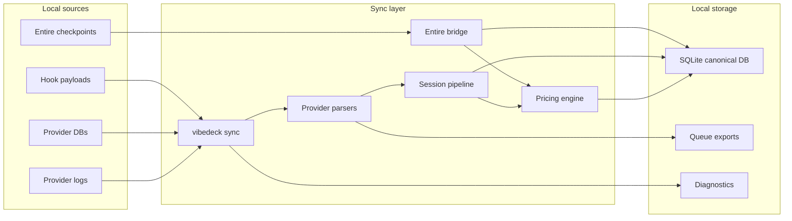
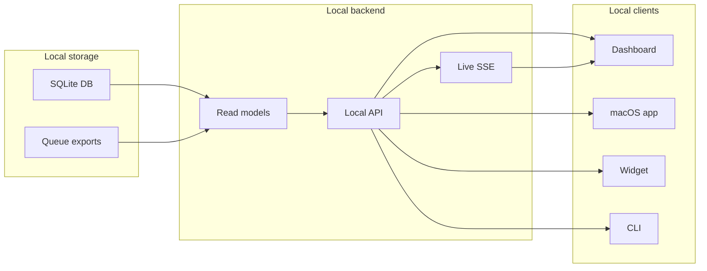
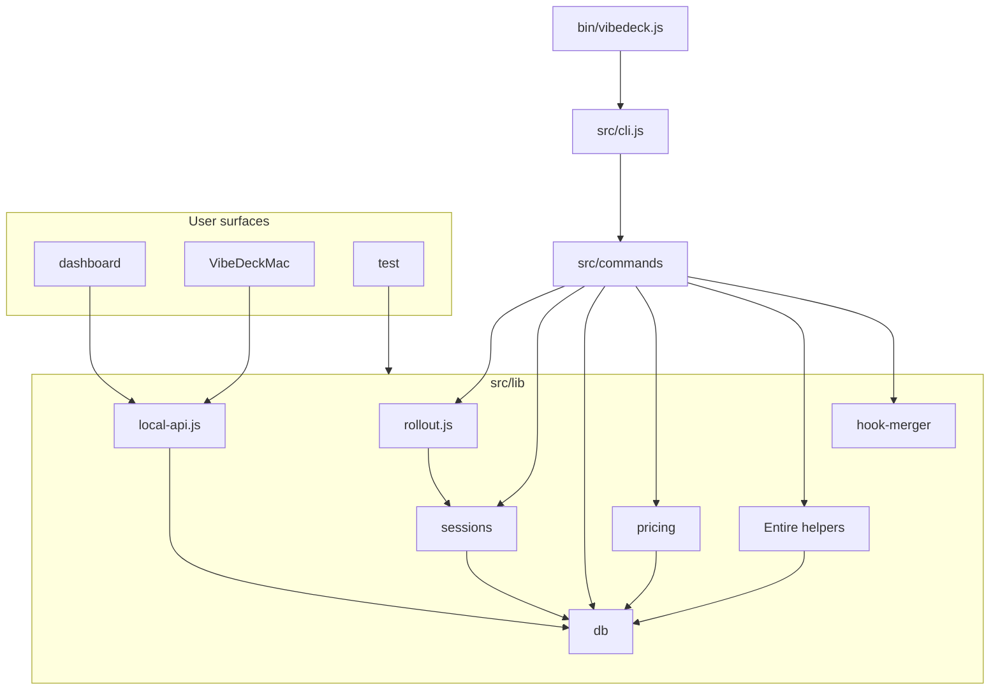
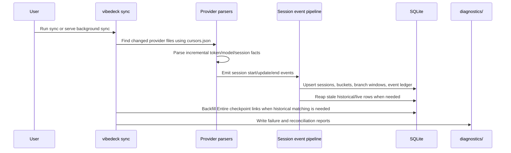
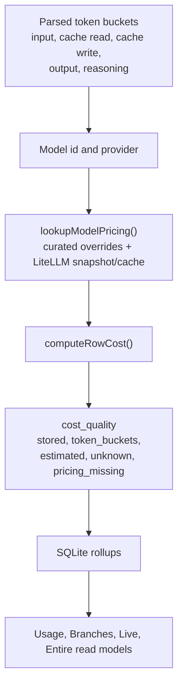

# Architecture

VibeDeck is a local-first AI coding usage system. It has three main jobs:

1. Collect local usage signals from AI coding tools.
2. Normalize sessions, tokens, models, branches, and costs into SQLite.
3. Serve those facts to the local dashboard, CLI, macOS app, and widgets.

## System-Level Flow

The system has two separate flows: local ingestion and local serving. Keeping them separate matters because sync/rebuild work can be heavy, while the dashboard should read from already-normalized local state.

### Local Ingestion



### Local Serving



The SQLite database is the canonical source for session, branch, live, usage, and Entire checkpoint cost facts. Queue files remain for compatibility and reconciliation.

## Codebase-Level Architecture



Key backend directories:

| Area | Files |
| --- | --- |
| CLI entry | `bin/vibedeck.js`, `src/cli.js`, `src/commands/*` |
| Provider parsing | `src/lib/rollout.js` and provider-specific helpers under `src/lib/*` |
| Canonical sessions | `src/lib/sessions/*` |
| Costing | `src/lib/pricing/*`, `src/lib/cost-estimation.js`, `src/lib/canonical-cost-summary.js` |
| Entire checkpoints | `src/lib/entire-bridge.js`, `src/lib/entire-checkpoint-usage.js` |
| Local API | `src/lib/local-api.js` |
| Dashboard | `dashboard/src/*` |
| Native app | `VibeDeckMac/*` |

## Local Data Model

Default root:

```text
~/.vibedeck/
  auth.token
  github.token
  cache/
    pricing.json
  tracker/
    vibedeck.sqlite3
    cursors.json
    queue.jsonl
    queue.state.json
    project.queue.jsonl
    project.queue.state.json
    diagnostics/
    app/
```

Important SQLite tables:

| Table | Purpose |
| --- | --- |
| `vibedeck_sessions` | One canonical row per provider session. Tracks repo, branch, model, token buckets, cost, timestamps, and live/end state. |
| `vibedeck_session_events` | Durable event ledger for session start/update/end processing. |
| `vibedeck_session_buckets` | Time bucket facts for usage pages and cost rollups. |
| `vibedeck_session_branch_windows` | Branch-window slices when a session spans branch changes. |
| `vibedeck_attribution_overrides` | Manual branch overrides. |
| `vibedeck_head_history` | Git HEAD and branch history used to resolve branch attribution. |
| `vibedeck_repos` | Known repo state, Entire state, suppression, and freshness metadata. |
| `vibedeck_session_entire_links` | Session-to-Entire link state for historical canonical linkage. |
| `vibedeck_entire_checkpoint_matches` | Checkpoint matching diagnostics and coverage state. |
| `vibedeck_skills` | Local skill inventory metadata. |

Schema migrations live in `src/lib/db/migrations/` and are applied by `ensureSchema()`.

## Ingestion Pipeline



Provider parsing is incremental. `cursors.json` records processed file positions and freshness timestamps so sync can resume without rereading every local file each time.

`--rebuild-vibedeck-db` intentionally clears canonical VibeDeck tables and rebuilds them from local provider logs. It is useful after parser changes, cost logic changes, or audit repair work.

## Provider Sources

VibeDeck supports a mix of active and passive providers:

| Provider family | Typical source |
| --- | --- |
| Codex and Every Code | Rollout/session JSONL files. |
| Claude Code | Project JSONL files under Claude local project state. |
| Gemini CLI | Session files under Gemini local state. |
| Cursor | Local config/session token plus usage CSV fetch when available. |
| OpenCode | Message files and local storage DB. |
| OpenClaw | VibeDeck hook/plugin signal plus session JSONL fallback. |
| Kiro and Kiro CLI | SQLite databases and JSONL fallback. |
| Kimi Code | Passive wire JSONL files. |
| GitHub Copilot CLI | OTEL JSONL files. |
| CodeBuddy, Craft, Hermes, oh-my-pi | Local files or SQLite state. |

Hook installation is handled by `vibedeck init` through provider-specific config helpers and `src/lib/hook-merger/*`.

## Costing Architecture



Costing code lives in:

- `src/lib/pricing/index.js`
- `src/lib/pricing/curated-overrides.json`
- `src/lib/pricing/seed-snapshot.json`
- `src/lib/cost-estimation.js`
- `src/lib/canonical-cost-summary.js`

Pricing behavior:

- Stored provider costs are preserved when they are authoritative.
- Token-bucket cost is computed when input/output/cache token buckets and model pricing are available.
- Missing pricing is not silently treated as a trustworthy zero.
- Cost rollups carry quality metadata so UI surfaces can distinguish known cost from unknown or estimated cost.
- Codex and Every Code use the same reasoning-output handling as the existing parser semantics.

Dashboard pages should use canonical SQLite-backed read models for cost. Queue exports can be used for compatibility, fallback, and reconciliation, but not as the cost baseline when canonical facts are complete.

## Branch and Project Attribution

VibeDeck resolves sessions into a project/worktree/branch umbrella:

```text
project
  worktree or branch
    session
      model, tokens, cost, time, provider
```

Branch resolution uses several tiers:

- Current repo and `.git` metadata when available.
- HEAD history captured by `src/lib/sessions/head-watcher.js`.
- Reflog and branch history fallbacks.
- Provider cwd and project path decoding.
- Manual overrides through `vibedeck attribute` or the dashboard.

If a repo has no usable `.git`, the UI treats it as no registered git rather than pretending unattributed rows are real branches.

## Live Sessions

Live data is not a separate source of truth. It is a projection over canonical session state.

Relevant modules:

- `src/lib/sessions/live-bus.js`
- `src/lib/sessions/live-rollups.js`
- `src/lib/sessions/workstreams.js`
- `src/lib/sessions/reaper.js`
- `src/lib/sessions/writer.js`

Live correctness rules:

- `last_observed_at` is session activity time.
- `updated_at` is row mutation time, not activity time.
- Historical open sessions older than the idle window are reaped.
- Active totals combine historical canonical session facts with current live token updates.

The dashboard receives live snapshots and server-sent events from local API routes under `/functions/vibedeck-sessions-live*`.

## Entire Checkpoint Usage

Entire is a local checkpoint/file browser integration. It is separate from provider logs: provider logs explain sessions over time, while Entire checkpoint metadata explains what token usage was attached to each saved checkpoint.

Entire checkpoint file browsing is read-only by default. VibeDeck reads checkpoint metadata through `src/lib/entire-bridge.js`.

For checkpoint cost display, VibeDeck reads child session `metadata.json` files listed by the checkpoint root metadata. Each child metadata file can include:

```json
{
  "agent": "Codex",
  "model": "gpt-5.5",
  "session_id": "...",
  "token_usage": {
    "input_tokens": 18087,
    "cache_creation_tokens": 0,
    "cache_read_tokens": 641152,
    "output_tokens": 3139
  }
}
```

`src/lib/entire-checkpoint-usage.js` computes per-metadata and per-checkpoint model/cost rollups from those child metadata files. Root checkpoint metadata is not used as the cost source when it lacks model breakdown.

## Local API

`src/lib/local-api.js` serves the dashboard and native app. It exposes read endpoints for:

- Usage summary, daily usage, heatmap, model breakdown.
- Project usage and project umbrella rollups.
- Branch usage and branch session details.
- Live session snapshots and live session SSE.
- Entire checkpoints and checkpoint file previews.
- Known repos, skills, status, doctor, and sync status.

Mutation routes are local-auth protected. Examples include:

- Branch attribution overrides.
- Local sync trigger.
- Entire rewind and cleanup.
- Skills install/uninstall/restore actions.

## Dashboard and Native App

The dashboard is a Vite/React app under `dashboard/`. It is built into `dashboard/dist` and served by `vibedeck serve`.

The macOS app lives under `VibeDeckMac/`. It embeds or starts the same local Node backend and points the native UI/widget surfaces at the local API.

## Security and Privacy Boundaries

- VibeDeck is local-first and binds the local server to `127.0.0.1`.
- Local write endpoints require `~/.vibedeck/auth.token`.
- GitHub README sync is opt-in and stores its token locally.
- Provider hooks are installed only after `init` consent or explicit `--yes`.
- Hook mergers preserve non-VibeDeck provider config.
- Prompt/response content is not uploaded by VibeDeck.

## Rebuild and Diagnostics

Important diagnostics paths:

```text
~/.vibedeck/tracker/diagnostics/
```

Common diagnostic outputs:

- Session event failure JSONL.
- Canonical reconciliation JSON.
- Entire checkpoint backfill JSON.
- Doctor output JSON when `doctor --out` is used.

Recommended health sequence:

```bash
rtk node bin/vibedeck.js sync --rebuild-vibedeck-db
rtk node bin/vibedeck.js doctor
rtk node bin/vibedeck.js serve --port 7690
```

Use `/usage`, `/branches`, `/entire`, and the live dashboard to verify that totals, cost, models, and branch attribution agree across surfaces.
