# Architecture

This document is for developers working on the VibeDeck backend, dashboard, native app, and release system.

VibeDeck has four major architecture layers:

1. local ingestion from provider runtimes
2. canonical normalization into SQLite
3. local serving to dashboard, CLI, macOS app, and widgets
4. packaging and release automation for npm, GitHub Releases, and Homebrew

## High-Level System

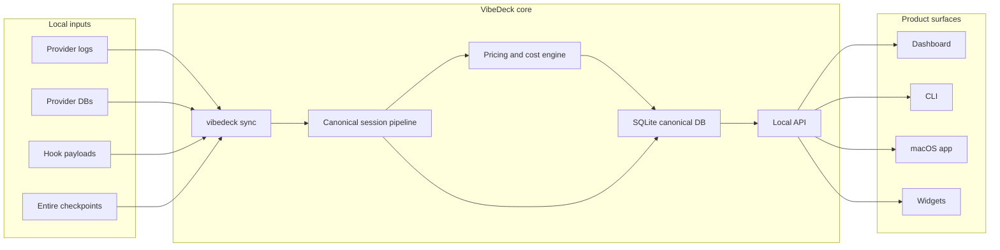

## Local Runtime Architecture

VibeDeck is intentionally local-first.

- state lives under `~/.vibedeck/`
- canonical usage state lives in `~/.vibedeck/tracker/vibedeck.sqlite3`
- the local server binds to `127.0.0.1`
- dashboard and native UI consume local API routes, not a hosted backend

### Local Ingestion Flow

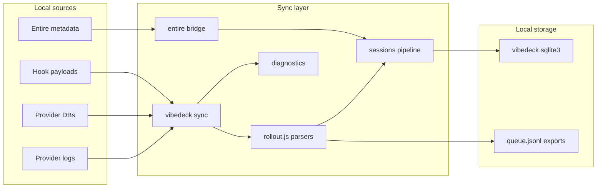

### Local Serving Flow

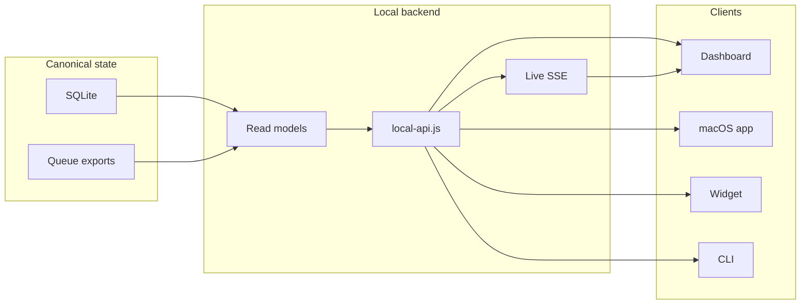

The SQLite database is the source of truth. Queue files remain for compatibility and reconciliation, not as the canonical cost source.

## Codebase Layout

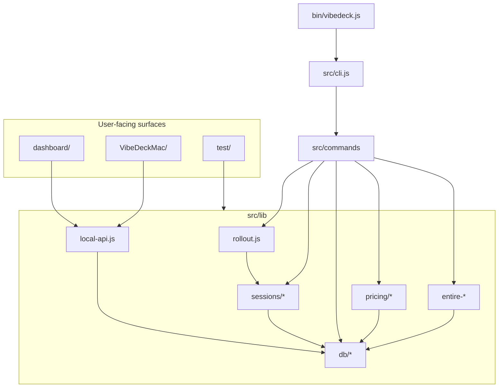

Key areas:

| Area | Files |
| --- | --- |
| CLI entry | `bin/vibedeck.js`, `src/cli.js`, `src/commands/*` |
| Parsing and compatibility | `src/lib/rollout.js` |
| Canonical sessions | `src/lib/sessions/*` |
| SQLite schema and migrations | `src/lib/db/*` |
| Costing | `src/lib/pricing/*`, `src/lib/cost-estimation.js`, `src/lib/canonical-cost-summary.js` |
| Entire checkpoint usage | `src/lib/entire-bridge.js`, `src/lib/entire-checkpoint-usage.js` |
| Local API | `src/lib/local-api.js` |
| Dashboard | `dashboard/src/*` |
| Native app and widget | `VibeDeckMac/*` |

## Canonical Data Model

Default local root:

```text
~/.vibedeck/
  auth.token
  github.token
  cache/
    pricing.json
  tracker/
    vibedeck.sqlite3
    cursors.json
    queue.jsonl
    queue.state.json
    project.queue.jsonl
    project.queue.state.json
    diagnostics/
    app/
```

Important tables:

| Table | Purpose |
| --- | --- |
| `vibedeck_sessions` | One canonical row per provider session. Tracks repo, branch, tokens, model, cost, timestamps, and live/end state. |
| `vibedeck_session_events` | Durable event ledger for start/update/end processing. |
| `vibedeck_session_buckets` | Time-bucket facts for usage pages. |
| `vibedeck_session_branch_windows` | Branch-window slices for sessions spanning branch changes. |
| `vibedeck_attribution_overrides` | Manual branch overrides. |
| `vibedeck_head_history` | Git HEAD history for branch resolution. |
| `vibedeck_repos` | Known repo state and freshness metadata. |
| `vibedeck_session_entire_links` | Session-to-Entire linkage. |
| `vibedeck_entire_checkpoint_matches` | Checkpoint matching diagnostics. |
| `vibedeck_skills` | Local skill metadata. |

Schema migrations live in `src/lib/db/migrations/`.

## Ingestion Pipeline

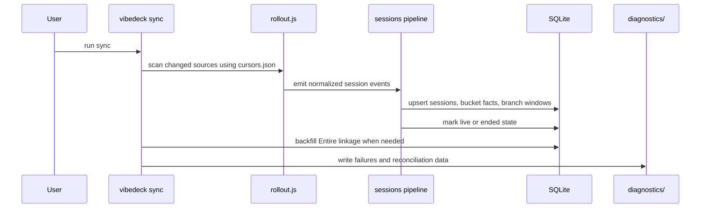

Important rule: `--rebuild-vibedeck-db` rebuilds canonical session state from local provider data. It is the heavy repair path after parser, session, or costing changes.

## Provider Ingestion Model

VibeDeck mixes active hooks and passive local readers:

| Provider family | Typical source |
| --- | --- |
| Codex and Every Code | session JSONL and rollout files |
| Claude Code | project JSONL state |
| Gemini CLI | local session files |
| Cursor | local config/session token plus usage CSV when available |
| OpenCode | local message files and storage DB |
| OpenClaw | hook/plugin signals plus session JSONL fallback |
| Kiro and Kiro CLI | SQLite and JSONL fallback |
| Kimi Code | passive wire JSONL |
| GitHub Copilot CLI | OTEL JSONL |
| CodeBuddy, Craft, Hermes, oh-my-pi | local files or SQLite state |

Hook installation is driven by `vibedeck init` and provider-specific helpers under `src/lib/*` and `src/lib/hook-merger/*`.

## Costing Architecture

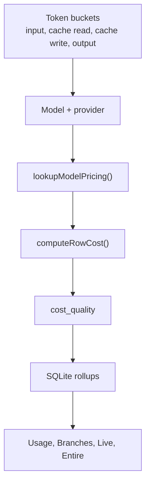

Costing behavior:

- stored provider cost is preserved when authoritative
- token-bucket cost is computed when model pricing and token buckets exist
- missing pricing is not silently treated as trustworthy zero
- read models carry cost quality metadata
- live views combine historical canonical facts with current live deltas

## Branch, Project, And Session Umbrella

VibeDeck resolves usage into:

```text
project
  worktree or branch
    session
      provider, model, tokens, cost, time
```

Branch resolution tiers:

- repo and `.git` metadata
- HEAD history from `src/lib/sessions/head-watcher.js`
- reflog and branch-window fallbacks
- provider cwd and project path decoding
- manual overrides from `vibedeck attribute`

If a repo has no usable `.git`, the UI should treat it as no registered git rather than a fake branch.

## Live Session Model

Live state is a projection over canonical session rows, not a separate source of truth.

Relevant modules:

- `src/lib/sessions/live-bus.js`
- `src/lib/sessions/live-rollups.js`
- `src/lib/sessions/workstreams.js`
- `src/lib/sessions/reaper.js`
- `src/lib/sessions/writer.js`

Important rules:

- `last_observed_at` is activity time
- `updated_at` is mutation time
- stale historical sessions must be reaped
- active totals must include previous canonical usage plus current live increments

Live API routes are served from `src/lib/local-api.js` under `/functions/vibedeck-sessions-live*`.

## Entire Checkpoint Usage

Entire checkpoint usage is derived from child `metadata.json` files, not only the root checkpoint metadata.

Each child metadata file can contain:

```json
{
  "agent": "Codex",
  "model": "gpt-5.5",
  "session_id": "...",
  "token_usage": {
    "input_tokens": 18087,
    "cache_creation_tokens": 0,
    "cache_read_tokens": 641152,
    "output_tokens": 3139
  }
}
```

`src/lib/entire-checkpoint-usage.js` aggregates child metadata rows into per-checkpoint model and cost rollups.

## Local Developer Workflows

### Typical backend workflow

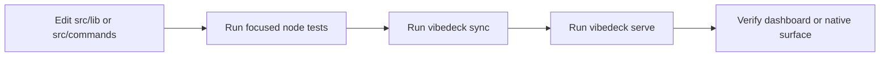

### Typical dashboard workflow

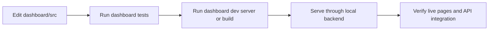

### Typical native workflow

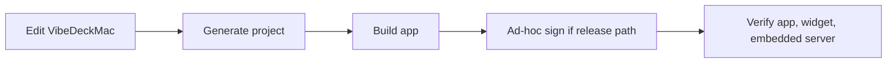

## Release Architecture

There are two release paths: local packaging and GitHub automation.

### Local release build

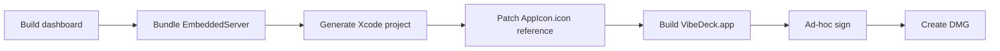

This path is implemented by:

- `scripts/build-release-mac.sh`
- `VibeDeckMac/scripts/bundle-node.sh`
- `VibeDeckMac/scripts/patch-pbxproj-icon.rb`
- `VibeDeckMac/scripts/create-dmg.sh`

### GitHub release automation

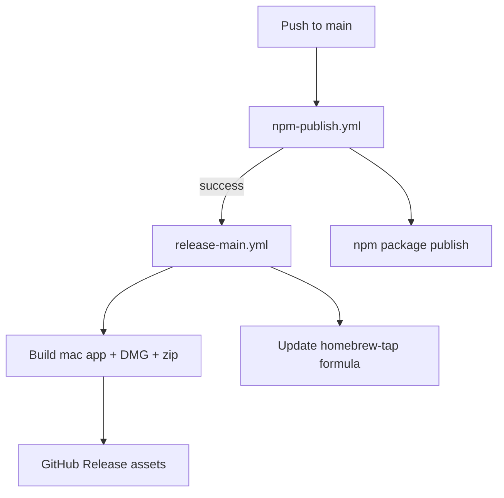

Current workflow files:

- `.github/workflows/npm-publish.yml`
- `.github/workflows/release-main.yml`
- `.github/workflows/release-dmg.yml` as manual fallback

Current release chain:

1. push to `main`
2. publish `vibedeck-cli` to npm
3. if npm publish succeeds, build macOS release assets
4. create GitHub release with `VibeDeck.dmg` and `VibeDeck-<version>-universal.zip`
5. compute npm tarball SHA and update `ivasuy/homebrew-tap`

Required GitHub secrets and variables:

| Name | Purpose |
| --- | --- |
| `NPM_TOKEN` | npm publish from CI |
| `HOMEBREW_TAP_TOKEN` | push formula updates to the tap repo |
| `HOMEBREW_TAP_REPO` | target tap repo, for example `ivasuy/homebrew-tap` |

## Security And Privacy Boundaries

- server binds to `127.0.0.1`
- local write routes require `~/.vibedeck/auth.token`
- GitHub README sync is opt-in
- hooks are installed only through explicit init flow
- prompt and response content is not uploaded by VibeDeck

## Diagnostics And Repair

Important repair tools:

- `vibedeck doctor`
- `vibedeck status --diagnostics`
- `vibedeck sync --rebuild-vibedeck-db`

Diagnostics are written under:

```text
~/.vibedeck/tracker/diagnostics/
```

Use rebuild when canonical session facts, bucket facts, or historical linkage need to be regenerated from raw local provider data.
