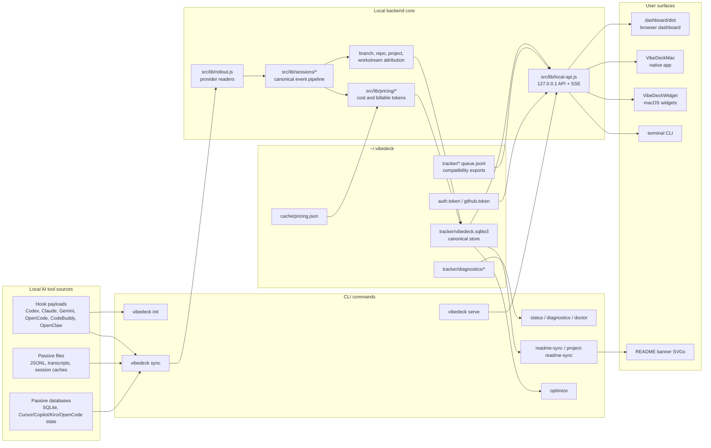
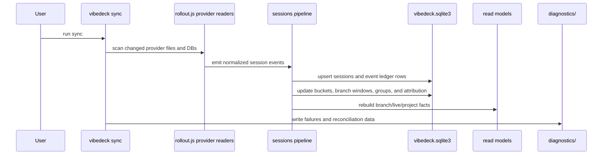
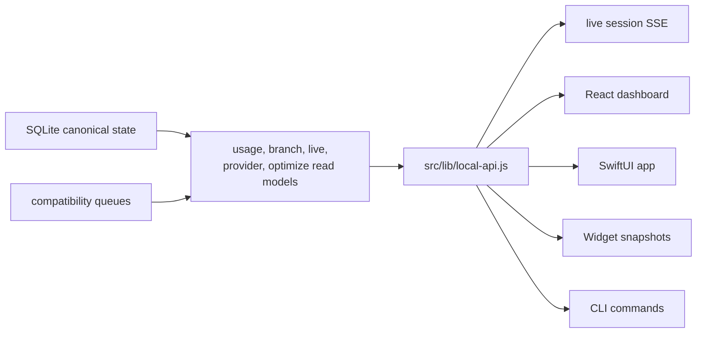
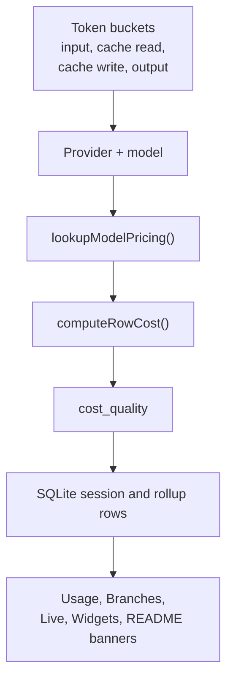
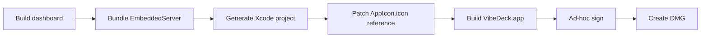
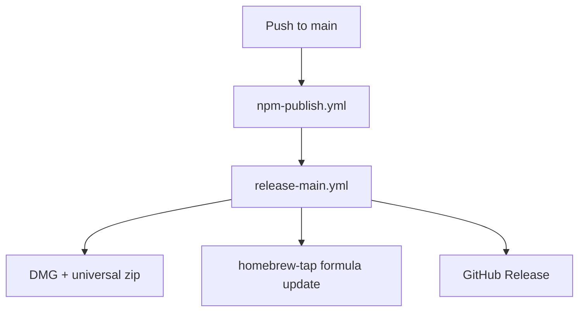

# Architecture

This document is for developers working on the VibeDeck CLI, local backend, dashboard, macOS app, widgets, and release system.

VibeDeck is a local-first app. It reads provider usage signals from files and local databases on the user's machine, normalizes them into a local SQLite database, and serves that state to the CLI, browser dashboard, native macOS app, and widgets.

## Runtime Structure


```mermaid
flowchart LR
  subgraph Sources["Local AI tool sources"]
    Hooked["Hook payloads\nCodex, Claude, Gemini, OpenCode, CodeBuddy, OpenClaw"]
    PassiveFiles["Passive files\nJSONL, transcripts, session caches"]
    PassiveDBs["Passive databases\nSQLite, Cursor/Copilot/Kiro/OpenCode state"]
  end

  subgraph Commands["CLI commands"]
    Init["vibedeck init"]
    Sync["vibedeck sync"]
    Serve["vibedeck serve"]
    Doctor["status / diagnostics / doctor"]
    Readme["readme-sync / project-readme-sync"]
    Optimize["optimize"]
  end

  subgraph Core["Local backend core"]
    Parsers["src/lib/rollout.js\nprovider readers"]
    Pipeline["src/lib/sessions/*\ncanonical event pipeline"]
    Pricing["src/lib/pricing/*\ncost and billable tokens"]
    Attribution["branch, repo, project,\nworkstream attribution"]
    API["src/lib/local-api.js\n127.0.0.1 API + SSE"]
  end

  subgraph Storage["~/.vibedeck"]
    DB["tracker/vibedeck.sqlite3\ncanonical store"]
    Queues["tracker/*.queue.jsonl\ncompatibility exports"]
    Diagnostics["tracker/diagnostics/*"]
    Auth["auth.token / github.token"]
    Cache["cache/pricing.json"]
  end

  subgraph Surfaces["User surfaces"]
    Dashboard["dashboard/dist\nbrowser dashboard"]
    Mac["VibeDeckMac\nnative app"]
    Widgets["VibeDeckWidget\nmacOS widgets"]
    Terminal["terminal CLI"]
    Banners["README banner SVGs"]
  end

  Hooked --> Init
  Hooked --> Sync
  PassiveFiles --> Sync
  PassiveDBs --> Sync
  Sync --> Parsers
  Parsers --> Pipeline
  Pipeline --> Attribution
  Pipeline --> Pricing
  Attribution --> DB
  Pricing --> DB
  DB --> API
  Queues --> API
  Diagnostics --> Doctor
  API --> Dashboard
  API --> Mac
  API --> Widgets
  API --> Terminal
  DB --> Readme
  Readme --> Banners
  DB --> Optimize
  Serve --> API
  Auth --> API
  Cache --> Pricing
```

Runtime rules:

- all default state lives under `~/.vibedeck/`
- the local server binds to `127.0.0.1`
- write routes use the local auth token at `~/.vibedeck/auth.token`
- `vibedeck.sqlite3` is the canonical store
- queue files remain compatibility and reconciliation exports, not the primary source of truth
- the browser dashboard and native app consume the same local API

## Repository Structure


```mermaid
flowchart TB
  Root["VibeDeck repo"]

  Root --> Bin["bin/vibedeck.js\ninstalled executable"]
  Root --> Src["src/"]
  Root --> Dashboard["dashboard/"]
  Root --> Mac["VibeDeckMac/"]
  Root --> Scripts["scripts/"]
  Root --> Tests["test/"]
  Root --> Docs["docs/"]
  Root --> Workflows[".github/workflows/"]

  Src --> CLI["src/cli.js\ncommand router"]
  Src --> CommandModules["src/commands/*\nserve, sync, init, status,\ndoctor, diagnostics, auth,\nreadme-sync, repo, optimize"]
  Src --> Lib["src/lib/*\nbackend domain modules"]

  Lib --> Readers["rollout.js\nprovider file/db readers"]
  Lib --> Sessions["sessions/*\nevents, branch windows,\nlive rollups, workstreams"]
  Lib --> DBLayer["db/*\nschema registry + migrations"]
  Lib --> API["local-api.js\nHTTP routes"]
  Lib --> Pricing["pricing/*\nmodel pricing and cost quality"]
  Lib --> Bootstrap["bootstrap/*\nfirst-run/native install helpers"]
  Lib --> ReadmeSync["readme-sync/*\nproject-readme-sync/*"]

  Dashboard --> ReactApp["dashboard/src\nReact/Vite app"]
  Dashboard --> BuiltAssets["dashboard/dist\nserved by CLI and packaged app"]

  Mac --> NativeApp["VibeDeckMac/VibeDeckMac\nSwiftUI app"]
  Mac --> WidgetExt["VibeDeckMac/VibeDeckWidget\nWidgetKit extension"]
  Mac --> Embedded["EmbeddedServer/vibedeck\npackaged Node backend"]

  Scripts --> ReleaseScripts["build-release-mac.sh\nrelease and smoke scripts"]
  Tests --> NodeTests["Node test suite"]
  Tests --> DashboardTests["Vitest dashboard tests"]
  Workflows --> ReleaseCI["npm publish, macOS release,\nDMG fallback"]
```

## Command Layer

`bin/vibedeck.js` delegates to `src/cli.js`, which registers the public command surface:

| Command | Module | Purpose |
| --- | --- | --- |
| `serve` | `src/commands/serve.js` | Start the local API, serve `dashboard/dist`, run optional background sync, start branch watching, and reap stale sessions. |
| `init` | `src/commands/init.js` | Configure local hooks, auth token, local tracker app state, and first-run sync. |
| `sync` | `src/commands/sync.js` | Read provider data, normalize session events, update SQLite projections, and write diagnostics. |
| `status` | `src/commands/status.js` | Print local provider and runtime status. |
| `diagnostics` | `src/commands/diagnostics.js` | Emit compact or pretty diagnostic state. |
| `doctor` | `src/commands/doctor.js` | Run scored health checks over DB completeness, hooks, live sessions, cost quality, and API reachability. |
| `attribute` | `src/commands/attribute.js` | Add or clear manual branch attribution overrides. |
| `auth` | `src/commands/auth.js` | Show or rotate the local write-auth token. |
| `readme-sync` | `src/commands/readme-sync.js` | Configure and update the GitHub/profile README usage banner. |
| `project-readme-sync` | `src/commands/project-readme-sync.js` | Update a local project's README banner block without GitHub API access. |
| `repo migrate` | `src/commands/repo.js` | Rewrite repo paths in local SQLite after a folder move. |
| `optimize` | `src/commands/optimize.js` | Run local optimization analysis and store findings. |
| `uninstall` | `src/commands/uninstall.js` | Remove installed hooks and optionally purge local state. |

## Ingestion Pipeline


```mermaid
sequenceDiagram
  participant User
  participant CLI as vibedeck sync
  participant Readers as rollout.js provider readers
  participant Pipeline as sessions pipeline
  participant DB as vibedeck.sqlite3
  participant Projections as read models
  participant Diagnostics as diagnostics/

  User->>CLI: run sync
  CLI->>Readers: scan changed provider files and DBs
  Readers->>Pipeline: emit normalized session events
  Pipeline->>DB: upsert sessions and event ledger rows
  Pipeline->>DB: update buckets, branch windows, groups, and attribution
  Pipeline->>Projections: rebuild branch/live/project facts
  CLI->>Diagnostics: write failures and reconciliation data
```

Important behavior:

- incremental runs use cursor state where provider data supports it
- `--rebuild-vibedeck-db` rebuilds canonical state from raw local provider records
- rebuild uses staged SQLite promotion so the last complete DB can remain usable until the rebuild succeeds
- recent-first rebuild lanes make current work available before older history finishes
- projection freshness and startup snapshots help the UI show readiness without blocking on full repair

## Provider Model

Providers are registered in `src/lib/provider-registry.js`. Current adapters include:

| Provider group | Typical source | Attribution depth |
| --- | --- | --- |
| Claude Code, Codex, EveryCode | local project/session logs and hook payloads | local project and branch when evidence exists |
| OpenCode, Goose, Crush, OMP, Pi, Droid | local files or DBs with cwd evidence | cwd-proven when absolute paths are present |
| Cursor | account/runtime data and CSV where available | account-level unless workspace proof exists |
| GitHub Copilot, Kiro, Craft | local runtime files or DBs | workspace-mapped where local state exposes it |
| Gemini, OpenClaw, Cursor Agent, Antigravity, Hermes, Kimi, CodeBuddy | passive local files, hooks, or provider caches | provider-only unless a local workspace path is proven |
| Qwen, IBM Bob, Roo Code, KiloCode | local task/chat files | cwd-optional |

Provider readers should preserve uncertainty. If a source does not prove a repo or branch, the session should remain provider-only or unattributed instead of inventing a fake branch.

## Canonical Storage

Default local root:

```text
~/.vibedeck/
  auth.token
  github.token
  cache/
    pricing.json
  tracker/
    vibedeck.sqlite3
    cursors.json
    queue.jsonl
    queue.state.json
    project.queue.jsonl
    project.queue.state.json
    diagnostics/
    app/
```

Core SQLite objects are created by `src/lib/db/migrations/*`:

| Table family | Purpose |
| --- | --- |
| `vibedeck_sessions` | Canonical session facts: provider, model, repo, branch, tokens, cost, timestamps, live/end state, and enrichment fields. |
| `vibedeck_session_events` | Durable normalized event ledger. |
| `vibedeck_session_buckets` and `vibedeck_session_bucket_facts` | Time-bucket usage read models. |
| `vibedeck_session_branch_windows` and `vibedeck_branch_usage_facts` | Branch/project rollups and branch-window slices. |
| `vibedeck_attribution_overrides` | Manual branch attribution overrides from `vibedeck attribute`. |
| `vibedeck_head_history` | Observed Git HEAD changes used during branch resolution. |
| `vibedeck_repos` | Repo metadata retained for migration compatibility. |
| `vibedeck_skills` | Local skill metadata. |
| `vibedeck_session_group_edges` and `vibedeck_session_group_skips` | Session grouping projection and diagnostics. |
| `vibedeck_optimize_runs` and `vibedeck_optimize_findings` | Optimize scan history and findings. |
| `vibedeck_projection_shards` | Projection freshness and shard state. |

## Branch, Project, And Session Attribution

VibeDeck resolves usage into this hierarchy when local evidence supports it:

```text
project
  repo or worktree
    branch
      session
        provider, model, tokens, cost, time
```

Resolution inputs:

- repo and `.git` metadata
- HEAD history from `src/lib/sessions/head-watcher.js`
- reflog and branch-window fallbacks
- provider cwd and project path decoding
- manual overrides from `vibedeck attribute`

If a repo has no usable Git metadata, the UI should show that honestly instead of fabricating a branch.

## Local Serving Flow


```mermaid
flowchart LR
  DB["SQLite canonical state"] --> ReadModels["usage, branch, live,\nprovider, optimize read models"]
  Queues["compatibility queues"] --> ReadModels
  ReadModels --> API["src/lib/local-api.js"]
  API --> SSE["live session SSE"]
  API --> Dashboard["React dashboard"]
  API --> Mac["SwiftUI app"]
  API --> Widgets["Widget snapshots"]
  API --> CLI["CLI commands"]
```

`vibedeck serve`:

- ensures the SQLite schema exists
- ensures local auth state exists
- optionally runs `sync --auto`
- starts the local API on `127.0.0.1`
- serves `dashboard/dist`
- starts HEAD watching and stale-session reaping
- starts the optimize schedule

Public dashboard routes today are `/dashboard`, `/live`, `/branches`, `/settings`, `/skills`, `/widgets`, `/compare`, `/models`, `/yield`, `/export`, `/optimize`, and `/plan`. `/usage` maps to the dashboard, and `/limits` redirects to the dashboard.

## Live Session Model

Live state is a projection over canonical session rows, not a separate source of truth.

Relevant modules:

- `src/lib/sessions/live-bus.js`
- `src/lib/sessions/live-rollups.js`
- `src/lib/sessions/workstreams.js`
- `src/lib/sessions/reaper.js`
- `src/lib/sessions/writer.js`

Important rules:

- `last_observed_at` is activity time
- `updated_at` is mutation time
- stale historical sessions must be reaped
- active totals include previous canonical usage plus current live increments

Live API routes are served from `src/lib/local-api.js` under `/functions/vibedeck-sessions-live*`.

## Costing Architecture


```mermaid
flowchart TD
  Buckets["Token buckets\ninput, cache read,\ncache write, output"] --> Identity["Provider + model"]
  Identity --> Pricing["lookupModelPricing()"]
  Pricing --> Compute["computeRowCost()"]
  Compute --> Quality["cost_quality"]
  Quality --> DB["SQLite session and rollup rows"]
  DB --> Surfaces["Usage, Branches,\nLive, Widgets, README banners"]
```

Costing behavior:

- stored provider cost is preserved when authoritative
- token-bucket cost is computed when model pricing and token buckets exist
- missing pricing is not silently treated as trustworthy zero
- billable token totals are stored separately from canonical total tokens
- daily heatmap rows include per-day cost where source data and pricing allow it
- read models carry cost quality metadata

## Dashboard And Native App

The dashboard is a Vite/React app under `dashboard/src`. The production CLI and native app serve built assets from `dashboard/dist`.

The macOS app is a SwiftUI app under `VibeDeckMac/VibeDeckMac`. The widget extension lives under `VibeDeckMac/VibeDeckWidget`. Release packaging copies a Node backend into `VibeDeckMac/EmbeddedServer/vibedeck`, starts it locally, and points native surfaces at the same local API used by the browser dashboard.

## Release Architecture


```mermaid
flowchart LR
  BuildDash["Build dashboard"] --> Bundle["Bundle EmbeddedServer"]
  Bundle --> Xcodegen["Generate Xcode project"]
  Xcodegen --> Patch["Patch AppIcon.icon reference"]
  Patch --> BuildApp["Build VibeDeck.app"]
  BuildApp --> Sign["Ad-hoc sign"]
  Sign --> DMG["Create DMG"]
```

Local release scripts:

- `scripts/build-release-mac.sh`
- `VibeDeckMac/scripts/bundle-node.sh`
- `VibeDeckMac/scripts/patch-pbxproj-icon.rb`
- `VibeDeckMac/scripts/create-dmg.sh`

GitHub workflow chain:


```mermaid
flowchart TD
  Push["Push to main"] --> NPM["npm-publish.yml"]
  NPM --> Release["release-main.yml"]
  Release --> MacAssets["DMG + universal zip"]
  Release --> Homebrew["homebrew-tap formula update"]
  Release --> GitHubRelease["GitHub Release"]
```

Current workflow files:

- `.github/workflows/npm-publish.yml`
- `.github/workflows/release-main.yml`
- `.github/workflows/release-dmg.yml` as a manual fallback

Required GitHub secrets and variables:

| Name | Purpose |
| --- | --- |
| `NPM_TOKEN` | npm publish from CI |
| `HOMEBREW_TAP_TOKEN` | push formula updates to the tap repo |
| `HOMEBREW_TAP_REPO` | target tap repo, for example `ivasuy/homebrew-tap` |

## Security And Privacy Boundaries

- server binds to `127.0.0.1`
- local write routes require `~/.vibedeck/auth.token`
- GitHub README sync is opt-in and uses `~/.vibedeck/github.token`
- hooks are installed only through the explicit `init` flow
- prompt and response content is not uploaded by VibeDeck

## Diagnostics And Repair

Important repair tools:

- `vibedeck status --diagnostics`
- `vibedeck diagnostics`
- `vibedeck doctor`
- `vibedeck sync --rebuild-vibedeck-db`

Diagnostics are written under:

```text
~/.vibedeck/tracker/diagnostics/
```

Use rebuild when canonical session facts, bucket facts, projection freshness, or historical linkage need to be regenerated from raw local provider data.
